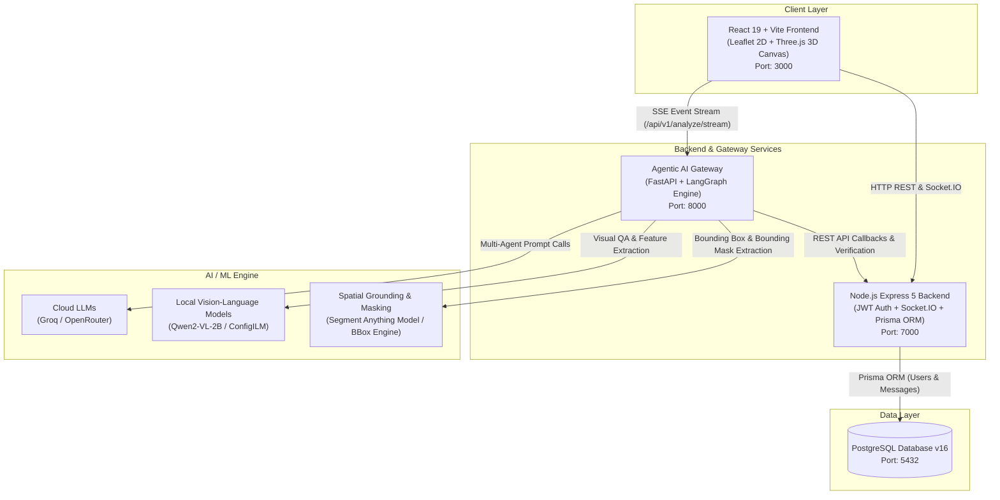
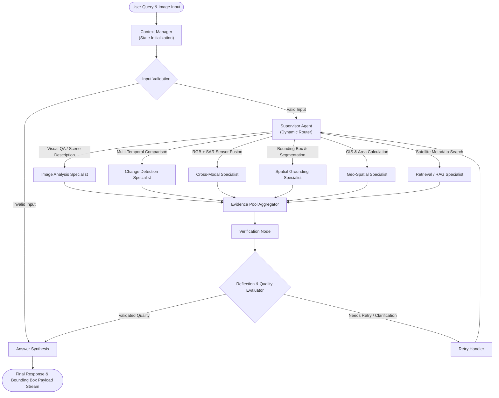
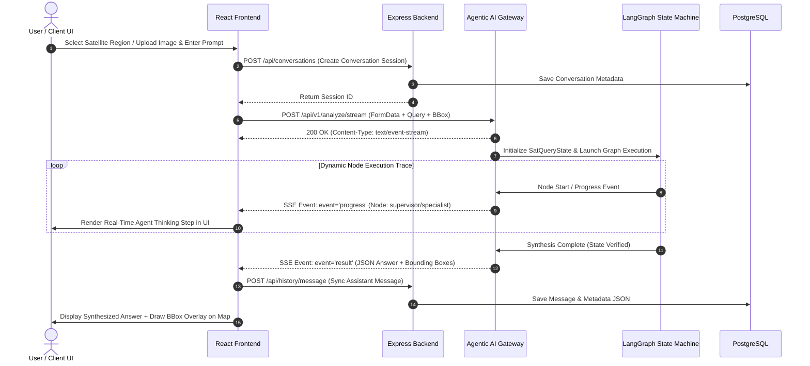
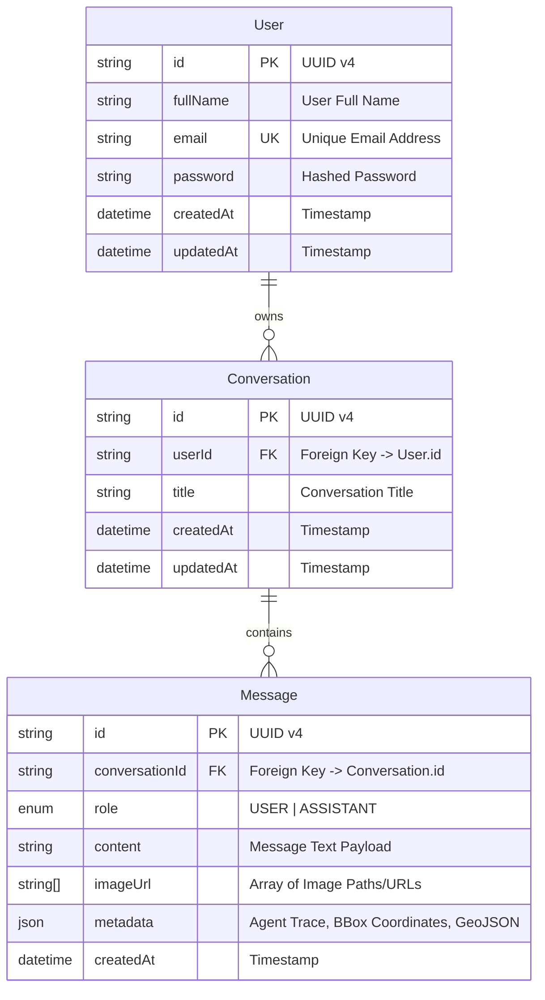
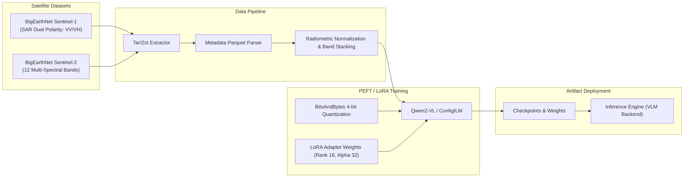

# ANTARIX 2.O — Multi-Agent Satellite Imagery AI Platform

> **Hackathon-Ready Intelligent Earth Observation & Satellite Visual QA Platform**  
> *Powered by LangGraph Agentic Orchestration, Fine-Tuned Vision-Language Models (Qwen2-VL / ConfigILM), Real-Time SSE/Socket.IO Streaming, and Interactive 2D/3D Geospatial UI.*

---

[](https://opensource.org/licenses/MIT)
[](https://www.python.org/)
[](https://fastapi.tiangolo.com/)
[](https://www.langchain.com/langgraph)
[](https://nodejs.org/)
[](https://react.dev/)
[](https://www.prisma.io/)
[](https://www.postgresql.org/)
[](https://www.docker.com/)

---

## Hackathon Executive Summary

**ANTARIX 2.O** solves a critical challenge in modern Earth Observation (EO): **extracting rapid, multi-modal, and spatial insights from high-resolution optical and Synthetic Aperture Radar (SAR) satellite imagery without requiring specialized GIS expertise.**

Traditional satellite analysis relies on manual photo-interpretation, fragmented GIS software, and static script execution. **ANTARIX 2.O** introduces an **Autonomous Multi-Agent Intelligence System** that breaks down natural language geospatial queries, routes tasks to specialized AI agents, executes vision-language inference, performs change detection across multi-temporal timestamps, and grounds objects spatially on an interactive 2D Leaflet and 3D Three.js canvas in real-time.

---

## Key Innovations & Core Features

- **Autonomous Multi-Agent Orchestration (LangGraph)**:
  Uses a dynamic **Supervisor-Specialist pattern** with multi-step reasoning, evidence aggregation, and self-correcting **Verification & Reflection loops**.
- **Multi-Spectral & Multi-Temporal Analysis**:
  Supports single-frame visual question answering, bi-temporal change detection ($T_1$ vs $T_2$), optical-SAR cross-modal reasoning, and GIS spatial grounding.
- **Fine-Tuned Satellite Vision Models**:
  Integrates custom fine-tuned **Qwen2-VL** and **ConfigILM** models trained on **BigEarthNet Sentinel-1 (SAR)** and **Sentinel-2 (Optical)** datasets using PEFT/LoRA and 4-bit quantization (`bitsandbytes`).
- **Real-Time SSE & WebSocket Event Streaming**:
  Streams node execution steps, intermediate reasoning traces, and grounding outputs live to the user interface via Server-Sent Events (SSE) and Socket.IO.
- **Interactive 2D/3D Geospatial UI**:
  React 19 frontend featuring dual Leaflet map layers, dynamic spatial bounding-box overlay selection, layer controls, and 3D Three.js visualizers.
- **Production-Grade Microservices Architecture**:
  Fully containerized stack powered by Docker Compose, automated database synchronization via Prisma ORM v7, and FastAPI OpenAPI documentation.

---

## System Architecture & Mermaid Diagrams

### 1. High-Level System Microservices Architecture



---

### 2. LangGraph Multi-Agent Execution State Machine



---

### 3. Real-Time Data & SSE Event Streaming Flow



---

### 4. Database Entity-Relationship Diagram (ERD)



---

### 5. Model Fine-Tuning & Training Pipeline Architecture



---

## Hackathon Track Alignment

| Track / Category | Features & Alignment |
| :--- | :--- |
| **AI & Agentic Systems** | Autonomous multi-agent LangGraph workflow featuring supervisor routing, specialist execution, verification, and reflection loops. |
| **Geospatial & Earth Observation** | Multi-spectral Sentinel-2 & Sentinel-1 SAR imagery ingestion, bi-temporal change detection, bounding box spatial grounding, dynamic Leaflet & 3D canvas map integration. |
| **Real-Time Interactive Apps** | Server-Sent Events (SSE) streaming for live agent reasoning step-by-step updates and real-time Socket.IO synchronization. |
| **Disaster Response & Urban Planning** | Rapid identification of flood areas, deforestation zones, urban growth, and infrastructure damage assessment. |

---

## Hardware & System Requirements

Depending on whether you run **ANTARIX 2.O** in local or recommended GPU mode, select the appropriate hardware configuration:

| Component | Minimum Spec  | Recommended Spec |
| :--- | :--- | :--- |
| **Processor (CPU)** | 4-Core / 6-Core x86_64 (Intel i5/i7 10th+ Gen, Ryzen 5) | 8-Core x86_64 (Intel i7/i9 12th+ Gen, Ryzen 7/9 5000+) |
| **System Memory (RAM)**| 8 GB – 16 GB RAM | 16 GB – 32 GB DDR4/DDR5 RAM |
| **Graphics Card (GPU)**| **NVIDIA GeForce RTX 2050** (or GTX 1650 / RTX 3050) | **NVIDIA RTX 3060 / 4060 / RTX 3080 / 4080 / T4 / A100** |
| **GPU VRAM** | **4 GB VRAM Minimum** (4-bit Quantization via `bitsandbytes`) | **6 GB VRAM** |
| **Storage** | 10 GB Available SSD Storage | 20 GB NVMe SSD Storage |
| **Operating System** | Windows 10/11 (PowerShell / WSL2), Linux | Windows 11 (PowerShell 7+ / WSL2), Linux (Ubuntu 22.04 LTS) |
| **Software Stack** | Python 3.11+, Node.js 18+, PyTorch + CUDA | Docker 24+ with NVIDIA Container Toolkit, Python 3.11+, Node.js 18+ |

---

## Quick Start & Deployment Guide

### Prerequisites
- [Docker Desktop](https://www.docker.com/products/docker-desktop/) (v24.0+)
- [Git](https://git-scm.com/)
- [Python 3.11+](https://www.python.org/)
- [Node.js 18+](https://nodejs.org/) & npm

---

### Option 1: Automated Windows PowerShell Setup (`setup.ps1` — Recommended for Windows & GPU)

For Windows environments with native GPU acceleration, run the automated setup script [`setup.ps1`](file:///c:/Users/mayan/Desktop/ANTARIX-SATQUERY_AI/setup.ps1). It verifies prerequisites, syncs `.env` files across all microservices, sets up Python CUDA 12.4 virtual environments, builds backend Prisma clients, installs frontend packages, and automatically launches all 3 microservices in separate interactive terminal windows!

```powershell
# 1. Open PowerShell as Administrator or User and set Execution Policy (if restricted)
Set-ExecutionPolicy -ExecutionPolicy RemoteSigned -Scope Process

# 2. Run setup script (installs all dependencies & launches all 3 live service windows)
.\setup.ps1
```

#### Script Flags & Customization Switches:
```powershell
# Force-recreate Python virtual environment from scratch
.\setup.ps1 -RecreateVenv

# Overwrite existing .env files from .env.example
.\setup.ps1 -ForceEnv

# Install dependencies only without auto-launching service terminal windows
.\setup.ps1 -NoStart

# Combine flags for clean environment reset
.\setup.ps1 -RecreateVenv -ForceEnv
```

#### What `setup.ps1` Executes Automatically:
1. **Prerequisite Check**: Validates Python 3.11+, Node.js 18+, and npm availability in `PATH`.
2. **Environment Synchronization**: Automatically copies `.env.example` to `.env` across Root, `AGENTIC-AI_GATEWAY`, `BACKEND`, and `frontend`.
3. **Gateway GPU Environment Setup**:
   - Creates a dedicated virtual environment in `AGENTIC-AI_GATEWAY/venv`.
   - Installs PyTorch & Torchvision with **CUDA 12.4 wheels** (`https://download.pytorch.org/whl/cu124`).
   - Installs core API requirements, vision ML requirements (`transformers`, `accelerate`, `qwen-vl-utils`), `bitsandbytes` (for 4-bit VLM quantization), geospatial libraries (`rasterio`, `pyproj`, `stac`), and installs `satquery` in editable mode.
4. **Backend Setup**: Installs npm dependencies and generates Prisma Client (`prisma7.config.ts`).
5. **Frontend Setup**: Installs React + Vite npm packages.
6. **Live Multi-Window Launch**: Opens 3 distinct PowerShell windows running:
   - Window 1: `Agentic AI Gateway` (`http://localhost:8000`)
   - Window 2: `Express Backend` (`http://localhost:7000`)
   - Window 3: `React Frontend` (`http://localhost:5173` or `:3000`)

---

### Option 2: Docker Compose (Multi-Container Orchestration)

Run the full interconnected stack with a single command:

```bash
# 1. Clone repo
git clone https://github.com/Manny2706/ANTARIX2.O.git
cd ANTARIX2.O

# 2. Configure Environment Variables
# Copy template env file and set your API keys
cp .env.example .env

# Edit .env to set GROQ_API_KEY if using cloud LLM inference:
# GROQ_API_KEY=gsk_your_groq_api_key_here

# 3. Build and launch all microservices
docker compose up --build
```

To run in detached background mode:
```bash
docker compose up -d --build
```

To stop all running services:
```bash
docker compose down
```

---

### Option 3: Unified All-in-One Container

Build and run all services in a single unified container managed by `supervisord`:

```bash
docker build -t antarix-unified .
docker run -p 3000:80 -p 7000:7000 -p 8000:8000 --env-file .env antarix-unified
```

---

### Option 4: Manual Step-by-Step Developer Setup (Native)

#### 1. Database Setup
```bash
docker run -d --name antarix-postgres -p 5432:5432 -e POSTGRES_DB=satquery -e POSTGRES_USER=postgres -e POSTGRES_PASSWORD=postgres postgres:16-alpine
```

#### 2. Agentic AI Gateway
```bash
cd AGENTIC-AI_GATEWAY
python -m venv venv
# On Windows:
.\venv\Scripts\activate
# On Linux/macOS:
# source venv/bin/activate

pip install -r requirements.txt
uvicorn satquery.main:app --host 0.0.0.0 --port 8000 --reload
```

#### 3. Backend Service
```bash
cd BACKEND
npm install
npx prisma db push
npm run dev
```

#### 4. Frontend Web App
```bash
cd frontend
npm install
npm run dev
```

---

## Service Access Points & Health Checks

| Service | Host URL | Description | Health Endpoint |
| :--- | :--- | :--- | :--- |
| **Frontend Web App** | `http://localhost:3000` | Interactive React 19 UI with 2D Leaflet & 3D Three.js | `http://localhost:3000` |
| **Express Backend** | `http://localhost:7000` | REST API, Auth, Socket.IO & Prisma ORM | `http://localhost:7000/health` |
| **Agentic AI Gateway** | `http://localhost:8000` | FastAPI Multi-Agent Engine | `http://localhost:8000/health` |
| **OpenAPI / Swagger Docs** | `http://localhost:8000/docs` | Interactive API documentation | - |
| **PostgreSQL Database** | `localhost:5432` | Data store for users & conversation history | `pg_isready` |

---

## Environment Variables Reference (`.env`)

| Variable | Default Value | Description |
| :--- | :--- | :--- |
| `FRONTEND_PORT` | `3000` | Port for the React frontend application |
| `BACKEND_PORT` | `7000` | Port for the Express backend REST & Socket server |
| `GATEWAY_PORT` | `8000` | Port for the Python FastAPI Agentic Gateway |
| `DB_PORT` | `5432` | Port for PostgreSQL database |
| `DB_USER` | `postgres` | Database username |
| `DB_PASSWORD` | `postgres` | Database password |
| `DB_NAME` | `satquery` | Database name |
| `GROQ_API_KEY` | `""` | Groq API Key for fast LLM inference |
| `GROQ_MODEL` | `openai/gpt-oss-120b` | Selected Groq LLM model |
| `OPENROUTER_API_KEY` | `""` | Optional OpenRouter API Key fallback |
| `VLM_BACKEND` | `local` | Set to `local` for local PyTorch GPU inference or `disabled` for CPU/cloud mode |
| `JWT_SECRET` | `antarix-super-secret-jwt-key` | Secret key for signing authentication tokens |
| `SOCKET_KEY` | `bgvpit303269bgwb9nishant` | Shared authorization secret for WebSocket events |

---

## API & Event Streaming Specification

### 1. Synchronous Analysis Endpoint (`POST /api/v1/analyze`)
Sends a natural language query alongside satellite imagery files or bounding box coordinates.

- **URL**: `http://localhost:8000/api/v1/analyze`
- **Content-Type**: `multipart/form-data`
- **Parameters**:
  - `query` (text): Question or instruction (e.g., *"Identify urban expansion and water bodies in this region"*).
  - `optical` (file): Sentinel-2 RGB multi-spectral image file.
  - `sar` (file): Sentinel-1 SAR image file.
  - `image_t1` (file): Time-1 satellite image for change detection.
  - `image_t2` (file): Time-2 satellite image for change detection.
  - `bbox` (string): Bounding box `[min_lon, min_lat, max_lon, max_lat]`.

---

### 2. Server-Sent Events (SSE) Streaming (`POST /api/v1/analyze/stream`)
Provides real-time event streaming of multi-agent reasoning steps.

- **URL**: `http://localhost:8000/api/v1/analyze/stream`
- **Stream Events**:
  - `start`: Graph execution initialized.
  - `progress`: Agent node step completion trace (`node_name`, `thinking_trace`, `timestamp`).
  - `result`: Final answer synthesis payload containing text, confidence, bounding boxes, and image artifacts.
  - `error`: Error payload detailing failure reason.

```json
// SSE Progress Event Example
event: progress
data: {
  "node": "change_detection",
  "status": "completed",
  "details": "Calculated NDVI differential matrix between T1 and T2 imagery.",
  "confidence": 0.94
}
```

---

## Model Training & Fine-Tuning Artifacts

The system includes fine-tuning workflows in [`MODEL_TRAINING/satquery.ipynb`](file:///c:/Users/mayan/Desktop/ANTARIX-SATQUERY_AI/MODEL_TRAINING/satquery.ipynb):

1. **Dataset Integration**:
   - **BigEarthNet-S1**: Sentinel-1 SAR imagery (VV and VH dual-polarization bands).
   - **BigEarthNet-S2**: Sentinel-2 multi-spectral optical imagery (12 spectral bands).
2. **Techniques Applied**:
   - **PEFT / LoRA (Low-Rank Adaptation)** for efficient parameter update.
   - **BitsAndBytes 4-Bit NormalFloat Quantization** for memory-efficient training on consumer GPUs.
   - **ConfigILM / Qwen2-VL** multimodal vision-language architectures.

---

## Hackathon Demo Walkthrough & Presentation Guide

For hackathon judges and live presentations, follow this 5-step demo script:

1. **Step 1 — Platform Overview & Map Initialization**:
   Open `http://localhost:3000`. Show the interactive Leaflet map interface, tile selection, and layer controls.
2. **Step 2 — Interactive Region Selection**:
   Draw a bounding box over a coastal or urban area on the Leaflet map.
3. **Step 3 — Multi-Agent Query Dispatch**:
   Enter prompt: *"Analyze the water bodies and detect construction changes between earlier and recent satellite passes."*
4. **Step 4 — Real-Time Agent Thinking Stream**:
   Highlight the UI **Agent Thinking Panel**. Point out how the **Supervisor Agent** routes the task to **Image Analysis**, **Change Detection**, and **Spatial Grounding** specialists in real-time.
5. **Step 5 — Grounded Output & Visual Bounding Boxes**:
   Show the final answer response alongside visual bounding boxes drawn directly on the 2D map overlay and 3D terrain canvas.

---

## Project Directory Structure

```text
ANTARIX-SATQUERY_AI/
├── AGENTIC-AI_GATEWAY/       # Python FastAPI + LangGraph AI pipeline
│   ├── satquery/             # Multi-agent LangGraph engine & nodes
│   │   ├── api/              # REST & SSE streaming routers
│   │   ├── graph/            # LangGraph builder, supervisor, and specialist nodes
│   │   ├── geospatial/       # GIS calculation utilities & bounding box logic
│   │   ├── vlm/              # Local VLM / Qwen2-VL inference module
│   │   └── segmentation/     # Segmentation & masking utilities
│   ├── Dockerfile            # Gateway container build specification
│   └── requirements.txt      # Python dependencies
├── BACKEND/                  # Express 5 + TypeScript + Socket.IO + Prisma
│   ├── src/                  # Controllers, routes, socket server, and services
│   ├── prisma/               # Database schema and migration files
│   ├── Dockerfile            # Backend container build specification
│   └── docker-entrypoint.sh  # Automatic DB migrations & launcher script
├── frontend/                 # React 19 + Vite + Leaflet + Three.js
│   ├── src/                  # UI components, interactive map viewer, SSE client
│   │   └── components/       # Dashboard, SearchPage, MapSelectModal components
│   ├── nginx.conf            # Reverse proxy & static SPA config
│   └── Dockerfile            # Multi-stage frontend container build
├── MODEL_TRAINING/           # Model fine-tuning notebooks & artifacts
│   ├── satquery.ipynb        # Jupyter notebook for BigEarthNet PEFT/LoRA fine-tuning
│   └── output.png            # Model training output visual proof
├── docker-compose.yml        # Multi-service microservice orchestrator
├── Dockerfile                # Root all-in-one unified container
├── .env.example              # Template environment configuration
├── supervisord.conf          # Process manager configuration for unified container
└── Readme.md                 # Project documentation
```

---

## Vision & Future Roadmap

- **Direct Copernicus & Sentinel Hub API Ingestion**: Live streaming satellite data directly into agent memory.
- **SAR Multi-Polarization Polarization Decomposition**: Enhanced flood and canopy penetration via polarimetric SAR analysis.
- **Edge AI Nanosatellite Deployment**: Quantized model export for on-satellite inference via ONNX and TensorRT.
- **Collaborative Multi-User GIS Rooms**: Real-time collaborative annotation powered by Socket.IO.

---

<p align="center">
  <b>Built for Earth Observation, Geospatial AI, and Hackathons worldwide.</b>
</p>
